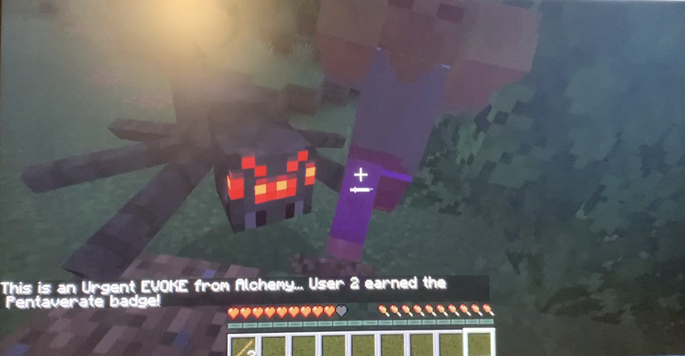
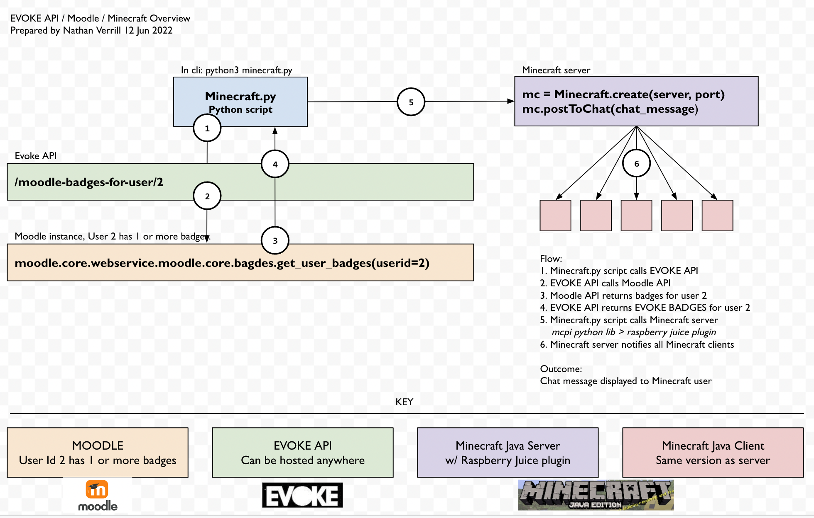

# MINECRAFT INTEGRATION WITH EVOKE API & MOODLE LMS

Nathan Verrill nathanverrill@gmail.com
10 Jun 2022

## OVERVIEW

This is a proof of concept for integrating Minecraft with Moodle LMS using a custom API for the World Bank's Evoke platform. The intent is to explore the possibility of using Minecraft as the gameful experience, backed with educational activities in the Moodle MLS.

See [Evoke: An Online Alternate Reality Game Supporting Social Innovation Among Young People Around the World](https://www.worldbank.org/en/topic/edutech/brief/evoke-an-online-alternate-reality-game-supporting-social-innovation-among-young-people-around-the-world)

Gameful features for the EVOKE platform. Currently supporting working tests of EVOKE Badges, which are created using data from the Moodle API. This allows EVOKE Badges to be awarded to users based on educational performance in Moodle, using Moodle's robust badge rules system, and also dispayed gamefully anywhere, including rich web experiences using modern technologies or in AAA game titles if they support integration via APIs. One example of AAA integration is with Minecraft, an example of which is included in `minecraft.py`.

### STATUS

- Returns one badge for a given user, specified with their Moodle user id.
- Badge posted to chat on a Minecraft server

Next steps

- returning all badges for a user
- richer interaction with Minecraft, such as adding blocks
- investigate PaperMC API (high performance Minecraft server) - https://papermc.io/

### TL/DR Running API

- Pull repo, activate python virtual environment, and load `requirements.txt`
- Set Moodle address in `main.py`
- Start EVOKE API - `uvicorn app.main:app --reload`
- Navigate to `http://127.0.0.1:8000/docs` for interactive documentation
- Use "try it out" feature to interact with the API

More on EVOKE API below

### Minecraft integration

Minecraft integration requires access to `port 4711` on a Minecraft: Java Edition server with the `raspberry juice` plugin installed.

- Pull repo, activate python virtual environment, and load `requirements.txt`
- Set Moodle address in `main.py`
- Start EVOKE API - `uvicorn app.main:app --reload`
- Set Minecraft server IP / address in `minecraft.py`
- Run `python3 minecraft.py`
- Observe chat appear on Minecraft server status or Minecraft client

More on EVOKE Minecraft below.

### Docker

`docker run -d --name evoke-api -p 8800:80 nathanverrill/evoke-api:latest`

then browse to `http://localhost:8800/docs`

More on EVOKE Docker below.

---

# The details

### EVOKE Badges

Rather than be limited to the badge functionality in Moodle, the EVOKE API retrieves 'Moodle badge' data and maps it to an 'EVOKE BADGE'. The EVOKE Badge API should be future-proof, introduce no breaking changes to consuming systems, and be completely agnostic with regard to its data source, therefor completely decoupled from Moodle.

### Rationale

At the time of this writing (June 2022), EVOKE uses Moodle learning management system (LMS) for the educational components of EVOKE. While Moodle is indeed used extensively, Moodle is inflexible in many regards, especially when creating a gameful experience. This is due in part to its legacy technology stack (PHP being the primary issue), but also because customization is not a priority for Moodle. Fortunately, Moodle provides a REST API for content in the platform that would be good to include in a separate web or mobile experience that is richer and more gameful.

We would like to use the Moodle API to provide an exciting, gameful experience for EVOKE players and students. Creating a rich experience is very difficult, if not impossible, in Moodle, and Moodle does not use modern coding frameworks - it's still `PHP`, and not `.NET Core`, `Django`, or similar. Fortunately Moodle does expose a number of `REST API` endpoints that return data in `JSON` format. Our hope is we will be able to use the API to do so.

This API also sets the stage for 'big thinking' integration with AAA game titles. A proof of concept is included in the `minecraft.py` script. The proof of concept demonstrates an example of providing players with a Minecraft in-game chat notification when a Moodle badge is earned. This is accomplished by integrating with Minecraft's python API. Minecraft has over 130 million users (https://www.businessofapps.com/data/minecraft-statistics/) and is owned by Microsoft. See https://coderdojotc.readthedocs.io/projects/python-minecraft/en/latest/classroom/mcpi.html. The APIs make additional integration opportunities possible, such as with Lego.

---

### Running APIs in Docker

The EVOKE APIs are built in Python using `FastAPI` (https://fastapi.tiangolo.com/) and containerized in Docker for Linux, Windows, Mac, and Apple M1. The Docker container is available on Docker Hub. When the Docker container is running, interactive API documentation is available at `http://localhost:8800/docs`. The container can be run with the following command:

`docker run -d --name evoke-api -p 8800:80 nathanverrill/evoke-api:latest`

Once running, the APIs can be called by other applications and interactive documentation viewed

`http://localhost:8800/docs`

---

## Development / running APIs without Docker

Note: Running APIs without Docker is required to integrate with Minecraft.

After cloning or downloading this repository on to Mac or Linux (or Windows, if Python is already configured) running the APIs is straightforward.

Commands should be executed in the same directory as the `requirements.txt` file (which is probably the root of where this repo has been cloned).

```
python3 -m venv env

source env/bin/activate

python3 -m pip install --upgrade pip

python3 -m pip install -r requirements.txt

```

You can then run the Jupyter notebook in VS Code. Using `notebooks/api-test.ipynb` is the easiest way to rapidly experiment.

To update the APIs themselves, familiarize yourself with `Fast API` and how to construct the schemas and implement functions. Note when developing for Fast API only use `PUT` HTTP methods. Never use `POST` unless there is a compelling legacy reason to do so.

When running/testing the APIs, execute the following command in the root of the project directory:

`uvicorn app.main:app --reload`

And navigate to `http://localhost:8800/docs` which will update automatically when changes are made to `app/main.py`.

---

### Minecraft integration

EVOKE Minecraft integration requires three things:

- A Minecraft: Java Edition server https://www.minecraft.net/en-us/store/minecraft-java-bedrock-edition-pc
- The `raspberry juice` Minecraft plugin https://github.com/zhuowei/RaspberryJuice
- The `mcpi` python library https://github.com/martinohanlon/mcpi

If the Minecraft server is already available, integration is straightforward:

- Set the Minecraft server address in `minecraft.py`. Update the port if the server's Minecraft port is non-standard.

```
minecraft_server = "192.168.1.32"
minecraft_server_port = 4711
```

- Run script:

```
python3 minecraft.py

```

- Observe chat message appear in Minecraft:



The `minecraft.py` script is querying the EVOKE API, which in turn queries the Moodle API.



---

### Minecraft server setup

Setting up a Minecraft server is more involved and requires comfort on the command line and familiarity with Linux.

This proof of concept used:

- `Ubuntu Linux 18.04`
- `java-17-openjdk` for running the Minecraft server
- `Paper 1.18.2-379` Minecraft Server. Paper MC is a high performance Minecraft server (https://papermc.io/)
- `Raspberry Juice v1.12.1` bukkit plugin compiled with `mvn` and `java-11-openjdk`
- `mcpi` Python library and a custom Python script, `minecraft.py`
- EVOKE APIs implemented with `FastAPI`, which call Moodle API

#### Paper Minecraft Server Installation:

```
sudo apt-get install openjdk-17-jre-headless
cd ~
mkdir minecraft-server && cd minecraft-server
wget https://api.papermc.io/v2/projects/paper/versions/1.18.2/builds/379/downloads/paper-1.18.2-379.jar
/usr/bin/java -Xmx1536M -Xms1536M -jar paper-1.18.2-379.jar nogui
```

- Minecraft server should start; type stop on Minecraft command line to shutdown
- Edit `eula.txt` and update the eula line: `eula=true`
- Edit `server.properties`
- Set `motd=EVOKE` as a friendly name for the server
- Set `server-ip=0.0.0.0` to allow any Minecraft clients to connect
- Start the server again `/usr/bin/java -Xmx1536M -Xms1536M -jar paper-1.18.2-379.jar nogui` to confirm, then stop

#### Raspberry Juice plugin

The Raspberry Juice Minecraft plugin allows the `mcpi` Python library to connect to the full Minecraft server like it does for the Raspberry Pi educational edition. You'll download plugin source and compile. Doing so requires Maven and Java 11, which you'll install. Finally you'll place it in the `minecraft-server/plugins` directory.

```
sudo apt-get install openjdk-11-jre-headless
sudo update-alternatives --config java
```

You should see at least two options: `/usr/lib/jvm/java-17-openjdk-amd64/bin/java` and `/usr/lib/jvm/java-11-openjdk-amd64/bin/java`. Choose Java 11. Now we'll install maven, download source, compile and copy into place.

```
sudo apt-get install maven
cd ~/Downloads
git clone https://github.com/zhuowei/RaspberryJuice
cd RaspberryJuice
mvn package
cp target/raspberryjuice-1.12.1.jar ~/minecraft-server/plugins
rm -r ~/Downloads/RaspberryJuice
```

Switch to Java 17 and start the Minecraft server

```
sudo update-alternatives --config java
/usr/bin/java -Xmx1536M -Xms1536M -jar paper-1.18.2-379.jar nogui
```

Starting the server after copying the plugin into place creates a `config.yml` file in RaspberryJuice directory. We'll update the config, and then start the server a final time.

- Modify `config.yml`:
- Set `hostname: 0.0.0.0` to allow any connections
- Set `location: ABSOLUTE`. The default setting, RELATIVE, is for Raspberry Pi version only
- Save file
  Now start the server

```
/usr/bin/java -Xmx1536M -Xms1536M -jar paper-1.18.2-379.jar nogui
```

#### Test Minecraft API

Connect one or more Minecraft games to the server.

The games should be Java edition (not Bedrock) and connect with a version compatible with the server, in this case 18.1 or 18.2. Connect by entering the server's IP Address. You can find the server's IP Address by typing `ip a` - you should see something like `inet 192.168.1.32` in the results.

While watching the game run `python3 minecraft.py` and you should see a chat message appear. The chat message contains badge information returned from Moodle. Change the text in the minecraft.py script and run it again; you should see the update in the game. You can also make a change in Moodle and see it reflected in Minecraft.

---

### Building for Docker

Building for Linux/Mac OSX/Windows and Apple 1 requires Docker buildx, which builds Docker images for multiple platforms at one time.

On the command line, login to docker hub and then execute the following:

`docker buildx create --use`

`docker buildx build --push --tag nathanverrill/evoke-api:latest --platform=linux/amd64,linux/arm64 .`

The first command resolves any issues that may exist from conflicts with multiple docker hub logins or behind-the-scenes confusion in your system. (Or maybe it's user error on my part of the author).

Once Docker images are pushed to a repo, they can be run with the following command:

`docker run -d --name evoke-api -p 8800:80 nathanverrill/evoke-api:latest`

Naturally you can change the port specification from 8800:80 to the port of your choosing, eg `-p 80:80`, and map local directories for sharing data by adding `-v data:/data`.

---

### Jupyter notebook

A `Jupyter` interactive python notebook is availabe in the source code to explore and test the APIs. The notebook can be run directly in `VS Code` and is the easiest way to experiment with the Moodle APIs.
